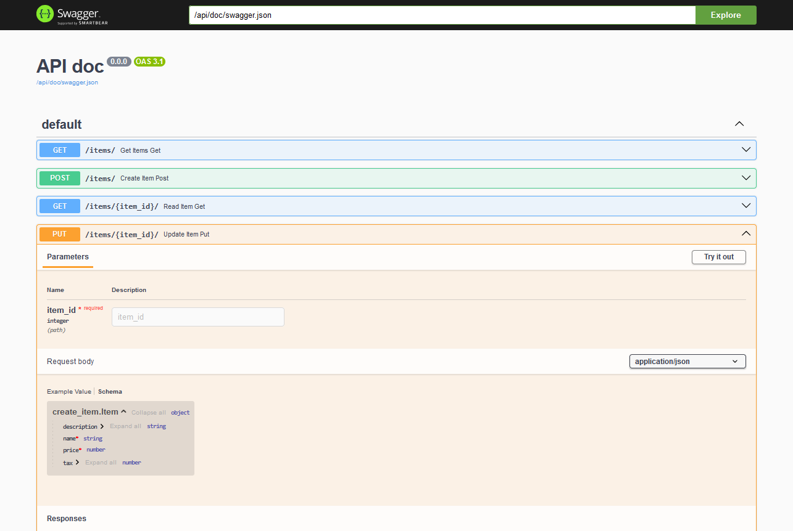
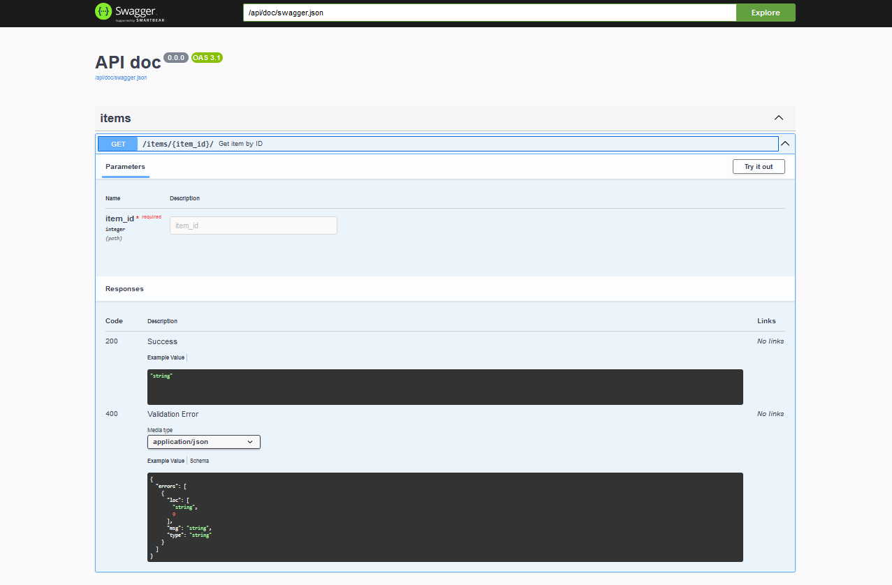

# OpenApi

This library automatically generates an OpenApi schema based on the type annotations defined in the application's
endpoints. This schema can be used both to document the API and to validate incoming requests with any library
compatible with OpenApi.

In the examples, we will use the `swagger-ui-py` library to visualize the documentation generated by
`flask_typed_routes`.

The schema is fully customizable to meet the specific needs of the application.

Additionally, the library provides the `typed_route` decorator, which allows parameterizing the various fields
supported by OpenApi to describe an operation. More details on its usage can be found in the corresponding sections of
this documentation.

!!! note
    Can be accessed through the `openapi_schema` attribute of the `FlaskTypedRoutes` instance.


## Basic Usage

!!! tip
    Ensure that the `swagger-ui-py` library is installed to visualize the OpenApi schema.

```bash
pip install swagger-ui-py  # ignore if already installed
```

```python
import typing as t

import flask.views
import pydantic
import swagger_ui

import flask_typed_routes as ftr

app = flask.Flask(__name__)
app_ftr = ftr.FlaskTypedRoutes(app)
swagger_ui.api_doc(app, config=app_ftr.openapi_schema, url_prefix='/api/doc', title='API doc')


class Item(pydantic.BaseModel):
    name: str
    description: str = None
    price: float
    tax: float = None


class Params(pydantic.BaseModel):
    skip: int = 0
    limit: int = pydantic.Field(le=100, default=10)
    status: str = pydantic.Field(description='status of the item', deprecated=True, default='active')


@app.get('/items/')
def get_items(params: t.Annotated[Params, ftr.Query()]):
    return flask.jsonify(params.model_dump())


@app.post('/items/')
def create_item(item: Item):
    return flask.jsonify(item.model_dump())


@app.get('/items/<item_id>/')
def get_item(item_id: int):
    return flask.jsonify({'item_id': item_id})


@app.put('/items/<item_id>/')
def update_item(item_id: int, item: Item):
    return flask.jsonify({'item_id': item_id, **item.model_dump()})


@app.delete('/items/<item_id>/')
def remove_item(item_id: int):
    return flask.jsonify({'item_id': item_id})
```

In this example if you run the application and navigate to `http://127.0.0.1:5000/api/doc`, you will see the
documentation generated by the `swagger-ui-py` library using the OpenApi schema generated by `flask_typed_routes`.

)


## Using `typed_route` decorator

The `typed_route` decorator allows you to parameterize the various fields supported by OpenApi to describe an operation.

```python
import flask.views
import swagger_ui

import flask_typed_routes as ftr

app = flask.Flask(__name__)
app_ftr = ftr.FlaskTypedRoutes(app)
swagger_ui.api_doc(app, config=app_ftr.openapi_schema, url_prefix='/api/doc', title='API doc')


@app.get('/items/<item_id>/')
@ftr.typed_route(
    summary='Get item by ID',
    tags=['items'],
)
def get_item(item_id: int):
    return flask.jsonify({'item_id': item_id})
```


