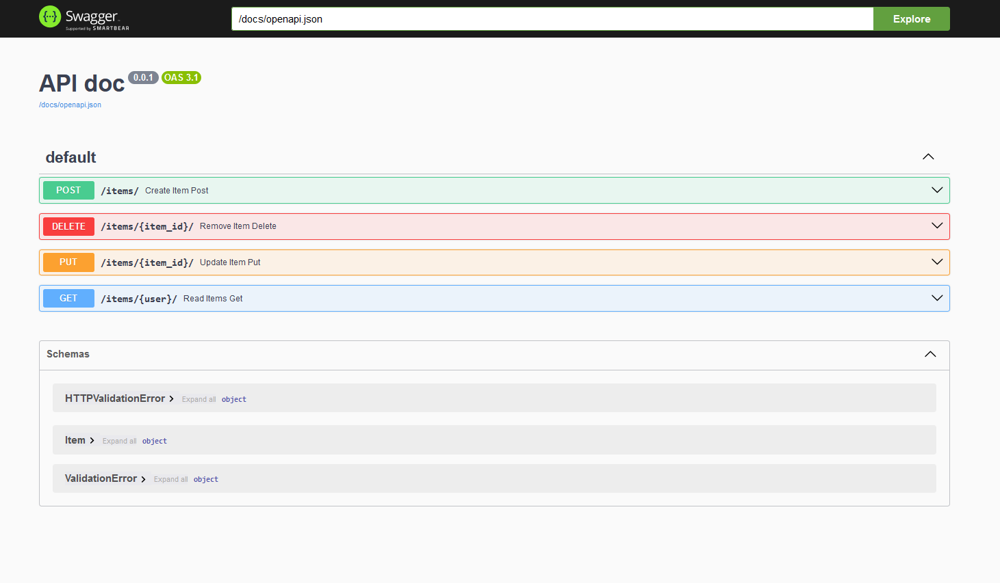
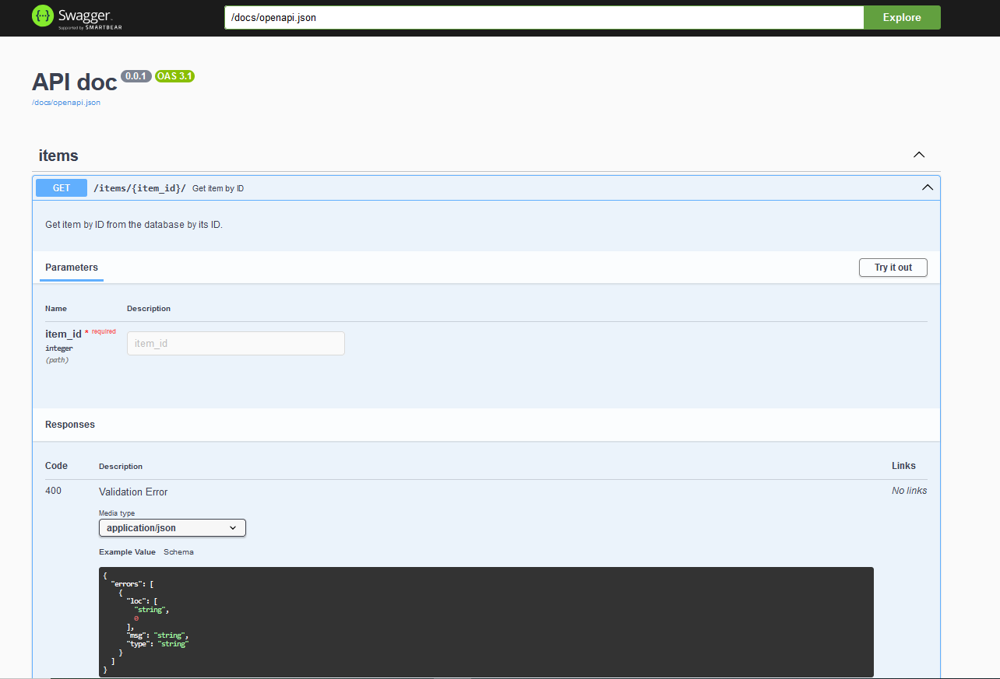
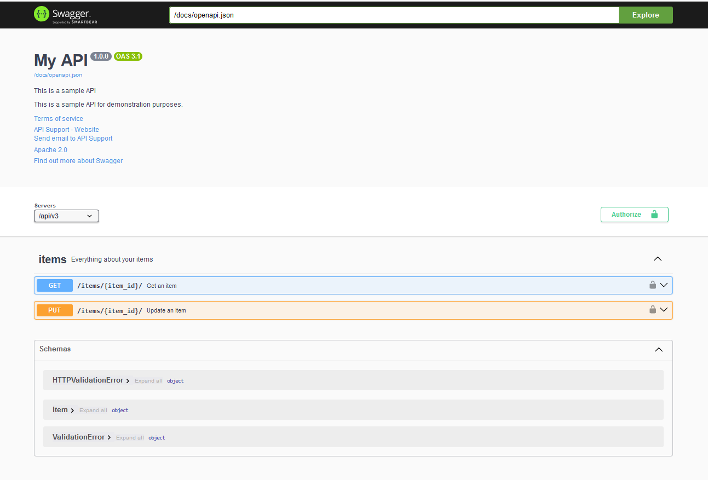

# OpenApi

This library automatically generates an OpenAPI schema based on the type annotations defined in the application's
endpoints.

In the examples, we will use the `swagger-ui-py` library to visualize the documentation generated by
`flask_typed_routes`.

The generated schema is fully customizable to meet the specific needs of your application.

Additionally, the library offers the `typed_route` decorator, which enables fine-grained control over the various fields
supported by OpenAPI to describe an operation. Detailed instructions on its usage can be found in the relevant sections
of this documentation.
Furthermore, the `FlaskTypedRoutes` class accepts keyword arguments (kwargs) corresponding to different OpenAPI
configuration fields. These can be used to fully customize the application's schema and tailor it to specific
requirements.

!!! note
    The OpenAPI schema is generated automatically when the application is run.
    You can customize the URL for serving the OpenAPI schema by configuring the `openapi_url_prefix`
    and `openapi_url_json` params in the `FlaskTypedRoutes` class.


## Basic Usage

!!! tip
    Ensure that the `swagger-ui-py` library is installed to visualize the OpenApi schema.

```bash
pip install swagger-ui-py  # ignore if already installed
```

```python
import flask
import pydantic
import swagger_ui

import flask_typed_routes as ftr

app = flask.Flask(__name__)
app_ftr = ftr.FlaskTypedRoutes(app)
swagger_ui.api_doc(app, config_rel_url=app_ftr.openapi_url_json, url_prefix=app_ftr.openapi_url_prefix)


class Item(pydantic.BaseModel):
    name: str
    description: str = None
    price: float


@app.get('/items/<user>/')
def read_items(user: str, skip: int = 0, limit: int = 10):
    data = {'user': user, 'skip': skip, 'limit': limit}
    return flask.jsonify(data)


@app.post('/items/')
def create_item(item: Item):
    return flask.jsonify(item.model_dump())


@app.put('/items/<item_id>/')
def update_item(item_id: int, item: Item):
    return flask.jsonify({'item_id': item_id, **item.model_dump()})


@app.delete('/items/<item_id>/')
def remove_item(item_id: int):
    return flask.jsonify({'item_id': item_id})
```

In this example if you run the application and navigate to `http://127.0.0.1:5000/docs`, you will see the
documentation generated by the `swagger-ui-py` library using the OpenApi schema generated by `flask_typed_routes`.



## Using `typed_route` decorator

The `typed_route` decorator allows you to parameterize the fields supported by OpenApi to describe an operation.

```python
import flask.views
import swagger_ui

import flask_typed_routes as ftr

app = flask.Flask(__name__)
app_ftr = ftr.FlaskTypedRoutes(app)
swagger_ui.api_doc(
    app,
    config_rel_url=app_ftr.openapi_url_json,
    url_prefix=app_ftr.openapi_url_prefix,
)


@app.get('/items/<item_id>/')
@ftr.typed_route(
    summary='Get item by ID',
    description='Get item by ID from the database by its ID.',
    tags=['items'],
)
def get_item(item_id: int):
    return flask.jsonify({'item_id': item_id})
```




## Customizing OpenAPI schema

For more advanced customization, you can pass additional parameters to the `FlaskTypedRoutes` class.

```python
import flask.views
import pydantic
import swagger_ui

import flask_typed_routes as ftr


class Item(pydantic.BaseModel):
    name: str
    description: str = None
    price: float
    tax: float = None


app = flask.Flask(__name__)
app_ftr = ftr.FlaskTypedRoutes(
    app=app,
    openapi_version='3.1.1',
    title='My API',
    version='1.0.0',
    summary='This is a sample API',
    description='This is a sample API for demonstration purposes.',
    terms_of_service='https://example.com/terms/',
    contact_info={
        'name': 'API Support',
        'url': 'http://www.example.com/support',
        'email': 'support@gmail.com'
    },
    license_info={
        'name': 'Apache 2.0',
        'url': 'https://www.apache.org/licenses/LICENSE-2.0.html',
    },
    servers=[{"url": "/api/v3"}],
    webhooks=None,
    tags=[
        {
            "name": "items",
            "description": "Everything about your items",
        }
    ],
    components={
        "securitySchemes": {
            'item_auth': {
                "type": "oauth2",
                "flows": {
                    "implicit": {
                        "authorizationUrl": "https://example.com/authorization",
                        "scopes": {
                            "read:items": "read items",
                            "write:items": "write items"
                        }
                    }
                }
            },
            "api_key": {
                "type": "apiKey",
                "name": "api_key",
                "in": "header",
            }
        }
    },
    external_docs={
        "description": "Find out more about Swagger",
        "url": "http://swagger.io"
    },
)
swagger_ui.api_doc(
    app,
    config_rel_url=app_ftr.openapi_url_json,
    url_prefix=app_ftr.openapi_url_prefix,
)


@app.get('/items/<item_id>/')
@ftr.typed_route(
    status_code=200,
    tags=['items'],
    summary='Get an item',
    description='Get an item by ID',
    security=[{'item_auth': ['read:items']}, {'api_key': []}]
)
def read_item(item_id: int):
    return flask.jsonify({'item_id': item_id})


@app.put('/items/<item_id>/')
@ftr.typed_route(
    status_code=202,
    tags=['items'],
    summary='Update an item',
    description='Update an item by ID',
    security=[{'item_auth': ['write:items']}]
)
def update_item(item_id: int, item: Item):
    return flask.jsonify({'item_id': item_id, **item.model_dump()})
```


